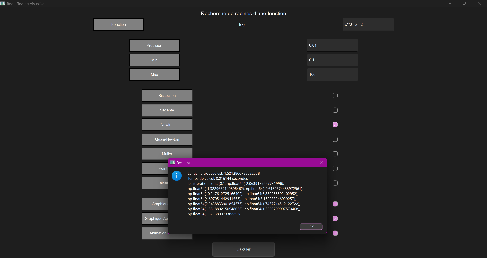
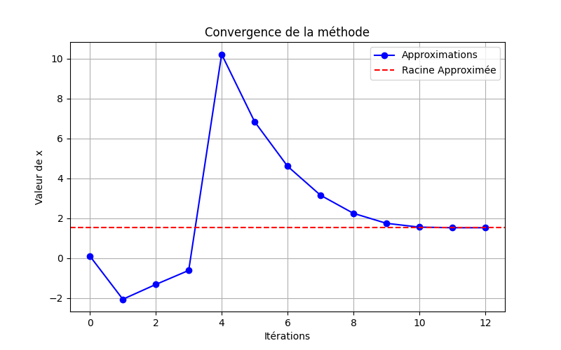
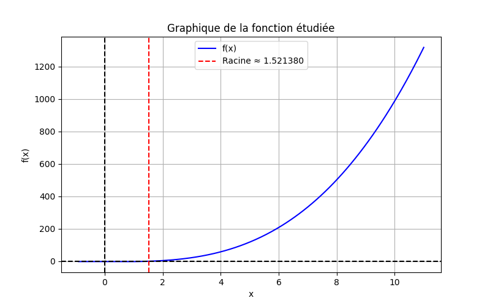
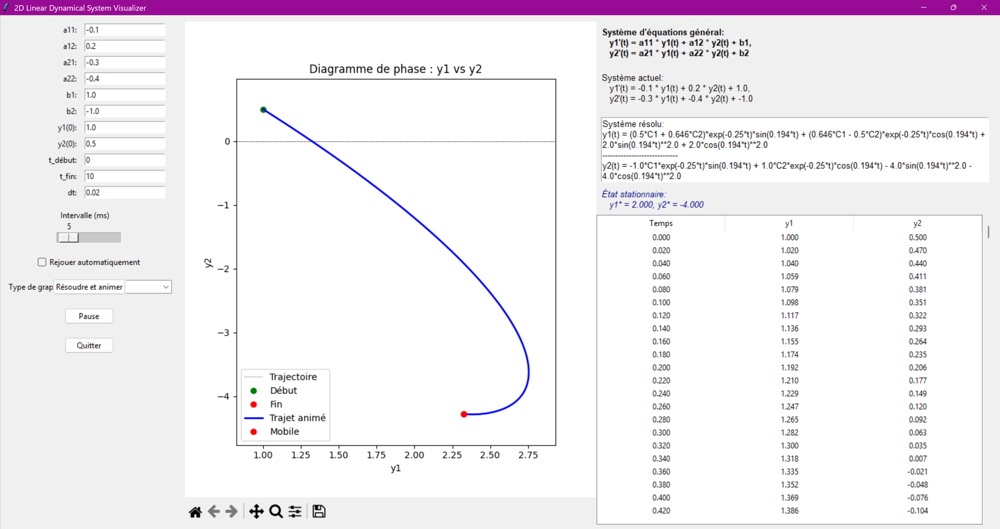

# Numerical Methods Resolution and Visualization

Interactive Python applications for solving and visualizing numerical problems through graphical user interfaces.

The repository contains two applications: a root-finding tool that compares several numerical algorithms and a two-dimensional linear dynamical-system solver combining numerical, symbolic, and graphical analysis.

## Root-Finding Visualizer

The root-finding application allows the user to define a function, select a numerical method and tolerance, compute a root, and inspect how the numerical approximation converges.

Implemented methods include:

- Bisection
- Secant method
- Newton's method
- Finite-difference quasi-Newton method
- Müller's method
- Fixed-point iteration
- Random search

### Application interface



The application returns the estimated root, computation time, and sequence of numerical approximations.

### Numerical convergence

<p align="center">
  
  
</p>

The convergence plot shows the sequence of approximations produced by the selected algorithm, while the function plot displays the estimated root relative to the function itself.

---

## Equation-System Resolution and Visualization

The second application analyzes two-dimensional linear dynamical systems of the form

\[
\begin{aligned}
y_1'(t) &= a_{11}y_1(t) + a_{12}y_2(t) + b_1, \\
y_2'(t) &= a_{21}y_1(t) + a_{22}y_2(t) + b_2.
\end{aligned}
\]

It combines numerical and symbolic analysis and provides:

- Numerical integration with SciPy
- Symbolic solutions with SymPy
- Stationary-state calculation
- Phase-space trajectories
- Time-series visualization
- Animated solutions
- Numerical result tables

### Application interface and phase-space visualization



The interface displays the model parameters, symbolic solution, stationary state, numerical trajectory, and corresponding phase-space representation.

---

## Run the Applications

Install the required dependencies:

```bash
pip install -r requirements.txt
```

Run the root-finding application:

```bash
python apps/root_finding_visualizer.py
```

Run the dynamical-system application:

```bash
python apps/equations_system_resolution_and_visualization.py
```

## Technologies

Python, NumPy, SciPy, SymPy, Matplotlib, PySide6, Tkinter, and Numdifftools.

## Purpose

This project illustrates how numerical algorithms can be combined with interactive interfaces and graphical visualization to make their behavior and results easier to interpret.
